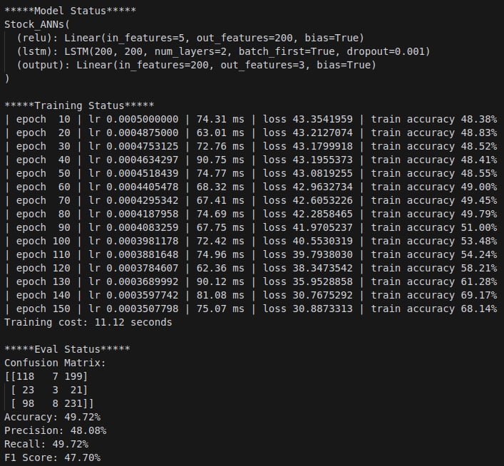

# 紀錄
## 當下情境
- 113-1 學年度(大三上)
- 大數據分析與智慧運算，指導教授 : 吳政瑋 助理教授
- 題目:台股或美股，1. 預測收盤價(回歸)，2. 預測漲跌(分類)

## 程式碼
- [ANNs.ipynb](./ANNs/ANNs.ipynb)，取得股票資訊、資料處理、建立模型、訓練模型、評估模型
## 開發環境
- 
- Docker 版本 : 24.0.7
- GPU : Nvidia GeForce RTX 4090 24G

## 程式碼介紹
### 第一步，取得股票資訊
我使用了 twstock 套件，取得台機電過去股票資訊，作為本次作業的資料。  

### 第二步，進行資料處理
我將資料進行正規化，並且將資料分為訓練組及測試組，作為本次作業的訓練資料及測試資料。  
由於預測收盤價和預測漲跌的資料處理不同，因此分為不同資料處理。  

### 第三步，建立模型
模型最前面有一層 ReLU 激活函數，中間有 LSTM 雙層，最後有一層全連接層輸出。  

### 第四步，訓練模型
我使用 Adam 優化器，對於回歸模型使用 MSE 損失函數，對於分類模型使用 CrossEntropy 損失函數。  

### 第五步，評估模型
我將模型進行評估，並且將結果進行視覺化。  

## 結語
本次作業讓我整合過去與本堂課期中專案產出的Code，  
雖然我對深度學習的認知與 Pytorch 有比較熟練，  
分類模型最高準確率有 49.72%(過去是 49.55%)，  

 

但似乎預測股票不能僅看這些股票的基本資訊，  
可能還需要看新聞正負面評價、大盤趨勢、國際事件...等，  
將它們量化成可參考的訓練資料，  
說不定能提升模型的準確率。

這次模型訓練過程中，  
我調整了許多的參數，  
發現 Batch Size 對於模型訓練的影響很大，  
Batch Size 小，模型訓練越慢、更新頻率高，訓練時間長，模型較不易發生欠擬合，  
Batch Size 大，模型訓練越快、更新頻率低、損失平均化、需長序列處理...等，導致欠擬合發生。  

## 預測測試資料圖
### 回歸

### 分類
